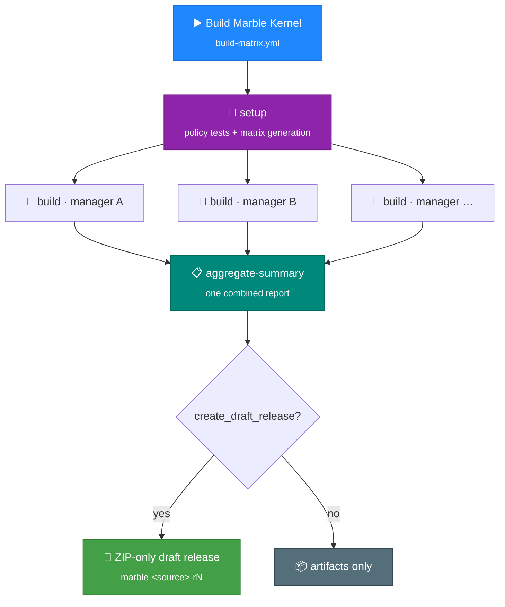
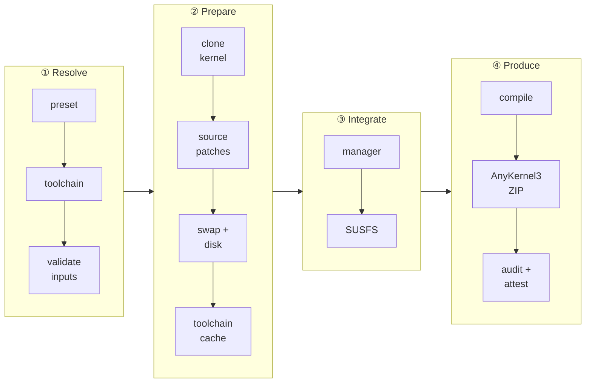

<div align="center">


<h3>CI-driven AnyKernel3 kernel builder for Poco F5 &amp; Redmi Note 12 Turbo</h3>

<p>
  <em>Pick a kernel source. Pick your root manager. Press run.</em><br/>
  <sub>Five upstream trees &middot; four KernelSU-family managers &middot; optional SUSFS &middot; zero in-tree patches</sub>
</p>

<p>
  <code>marble</code> &nbsp;·&nbsp; <code>marblein</code>
</p>

<p>
  <a href="https://github.com/mohdakil2426/marble-kernel-builder/actions"></a>
  <a href="https://github.com/mohdakil2426/marble-kernel-builder"></a>
  <a href="https://gitlab.com/simonpunk/susfs4ksu"></a>
</p>

<p>
  
  
  
  
  
</p>

<p>
  <a href="#-quick-start"><b>Quick start</b></a> &nbsp;·&nbsp;
  <a href="#-kernel-sources"><b>Sources</b></a> &nbsp;·&nbsp;
  <a href="#-managers--susfs"><b>Managers</b></a> &nbsp;·&nbsp;
  <a href="#-how-a-build-runs"><b>Pipeline</b></a> &nbsp;·&nbsp;
  <a href="#-flashing"><b>Flashing</b></a> &nbsp;·&nbsp;
  <a href="docs/ARCHITECTURE.md"><b>Architecture</b></a>
</p>

</div>

---

> [!CAUTION]
> **Flashing a custom kernel can bootloop or brick your device, and your warranty may no longer be valid.**
>
> Everything here is experimental and provided **as-is**. Before you flash:
>
> | | Requirement |
> |:---:|---|
> | 🔓 | Unlocked bootloader |
> | 📱 | **Poco F5** (`marblein`) or **Redmi Note 12 Turbo** (`marble`) — no other device |
> | 💾 | A stock `boot.img` from the **exact same ROM build**, saved **off-device** |
> | 🧩 | A ZIP matching your **ROM family** — see [compatibility](#-kernel-sources) |
>
> By flashing these artifacts you accept all risk. The maintainer is not responsible for bricked devices or data loss.

---

## ✨ What this is

Marble Kernel Builder is a **GitHub Actions pipeline** that compiles a flashable kernel for the Poco F5 / Redmi Note 12 Turbo without ever touching upstream kernel source.

The core idea is separation:

```
   this repo                          upstream kernel trees
   ─────────                          ─────────────────────
   workflows · scripts                Melt · LineageOS · Evolution-X
   config    · packaging     ──▶      aosp-pablo · pa-gr
                                      (cloned clean, patched only in
   never patched in-tree               the ephemeral CI workspace)
```

Root managers and SUSFS are applied **inside the runner's temp workspace** and thrown away when the job ends. Nothing is ever committed back to a kernel tree.

| | Capability |
|:---:|---|
| 🧬 | **5 kernel sources** — one dropdown: Melt (HyperOS), LineageOS, Evolution-X, aosp-pablo, pa-gr |
| 🔑 | **4 root managers + baseline** — KernelSU, KernelSU-Next, SukiSU Ultra, ReSukiSU, or clean no-root |
| 🛡️ | **Optional SUSFS** — pinned `v2.2.0` / `v2.1.0` presets, or a custom ref |
| ⚙️ | **Selectable LTO** — `none` · `thin` (default) · `full`, hardened for free runners |
| 📦 | **AnyKernel3 ZIPs** — codename verification + automatic boot backup before flashing |
| 🚀 | **Parallel matrix builds** — build every manager at once, one combined summary |
| 🔒 | **Pinned & attested** — commit-pinned toolchains, allowlisted managers, OIDC artifact attestations |

---

## 🚀 Quick start

<table>
<tr><td width="60" align="center"><h3>1</h3></td><td>

Open **[Actions → Build Marble Kernel → Run workflow](https://github.com/mohdakil2426/marble-kernel-builder/actions)**

</td></tr>
<tr><td align="center"><h3>2</h3></td><td>

Pick a **kernel source** and tick the **manager(s)** you want.
Leave `toolchain=auto` and `lto=thin` — they are already right for every preset.

</td></tr>
<tr><td align="center"><h3>3</h3></td><td>

Run it. When the job is green, download the artifact and flash the `.zip`.

</td></tr>
</table>

> [!TIP]
> **First time here?** Build `kernel_source=melt` with `build_none` and `lto=thin`. That is the fastest path to a known-good, no-root kernel and proves your flash workflow before root enters the picture. Then follow the [safe build order](#-safe-build-order).

---

## 🧬 Kernel sources

Presets are named after the project that maintains the tree. Selected from the `kernel_source` dropdown; defined in [`config/kernel-sources.json`](config/kernel-sources.json).

| Preset | Upstream tree | Default ref | Defconfig | ROM family |
|---|---|---|---|---|
| **`melt`** | [`mohdakil2426/android_kernel_xiaomi_marble`](https://github.com/mohdakil2426/android_kernel_xiaomi_marble) | `melt-rebase` | `marble_defconfig` | 🟢 Stock **HyperOS** |
| **`lineageos`** | [`LineageOS/android_kernel_xiaomi_sm8450`](https://github.com/LineageOS/android_kernel_xiaomi_sm8450) | `lineage-23.2` | GKI + fragments | 🟠 **LOS-based** ROMs |
| **`evolution-x`** | [`Evolution-X-Devices/kernel_xiaomi_sm8450`](https://github.com/Evolution-X-Devices/kernel_xiaomi_sm8450) | `cnb` | GKI + fragments | 🟠 **LOS-based** ROMs |
| **`aosp-pablo`** | [`aosp-pablo/android_kernel_xiaomi_sm8450`](https://github.com/aosp-pablo/android_kernel_xiaomi_sm8450) | `16` | GKI + fragments | 🟠 **LOS-based** ROMs |
| **`pa-gr`** | [`pa-gr/android_kernel_xiaomi_sm8450`](https://github.com/pa-gr/android_kernel_xiaomi_sm8450) | `vauxite` | GKI + fragments | 🟠 **LOS-based** ROMs |

> [!WARNING]
> **ROM family is not interchangeable.** A `melt` build is for **stock HyperOS**. The four LOS-family builds are for **LineageOS-based custom ROMs only**. Flashing across families is the most common way to bootloop this device.

<details>
<summary><b>How the two defconfig modes differ</b></summary>

<br/>

**`single`** (Melt) — a plain, complete device defconfig:

```bash
make marble_defconfig
```

**`gki_fragments`** (all LOS-family presets) — generic GKI base plus vendor overlays merged on top:

```text
gki_defconfig
  + vendor/waipio_GKI.config     # SoC   (SM8450)
  + vendor/xiaomi_GKI.config     # OEM
  + vendor/marble_GKI.config     # device
  + vendor/debugfs.config
```

This is why LOS presets need a newer compiler — the merged config enables armv9 code paths that Android's `clang-r416183b` does not accept.

</details>

<details>
<summary><b>Source-local patches (pa-gr)</b></summary>

<br/>

A preset may carry patches applied **to the CI checkout only**, never pushed upstream. Today exactly one exists:

| Preset | Patch | Why |
|---|---|---|
| `pa-gr` @ `vauxite` | [`0001-kvm-arm64-init-clidr-for-clang22.patch`](patches/kernel-sources/pa-gr/vauxite/) | Clang 22 raises `-Wuninitialized-const-pointer` on `sys_regs.c` |

Delete the patch directory once upstream ships an equivalent fix. `pa-gr@vauxite` may also ship **in-tree KernelSU** — smoke-test manager apply before trusting a root build from it.

</details>

---

## 🔑 Managers & SUSFS

Only **official upstream** manager repositories are allowlisted at CI time. Random forks are rejected by [`validate-inputs.sh`](scripts/validate-inputs.sh) and covered by policy tests.

| Manager | Plain | + SUSFS | Resolved source |
|---|:---:|:---:|---|
| `none` | ✅ | — | Baseline no-root validation build |
| `kernelsu` | ✅ | ❌ | [`tiann/KernelSU@main`](https://github.com/tiann/KernelSU) |
| `kernelsu-next` | ✅ | ✅ | official [`@dev`](https://github.com/KernelSU-Next/KernelSU-Next) → SUSFS switches to [`pershoot@dev-susfs`](https://github.com/pershoot/KernelSU-Next) |
| `sukisu-ultra` | ✅ | ✅ | [`@main`](https://github.com/SukiSU-Ultra/SukiSU-Ultra) → SUSFS switches to official `@builtin` |
| `resukisu` | ✅ | ✅ | [`@main`](https://github.com/ReSukiSU/ReSukiSU) — manager-side SUSFS is built in |

> [!NOTE]
> **The one sanctioned exception** is `pershoot/KernelSU-Next@dev-susfs` — a CI-proven fork of official `dev` — used *only* for KernelSU-Next + SUSFS, because the official KernelSU-Next SUSFS path is not Marble-compatible. Official **KernelSU + SUSFS stays rejected** until a compatible integration exists.

**For SUSFS builds, use `kernelsu-next`, `sukisu-ultra`, or `resukisu`.** SUSFS with `none` or `kernelsu` is blocked at validation.

<details>
<summary><b>SUSFS pins &amp; userspace module</b></summary>

<br/>

Kernel branch `gki-android12-5.10`, from [`simonpunk/susfs4ksu`](https://gitlab.com/simonpunk/susfs4ksu):

| Preset | Target | Description |
|---|---|---|
| `latest` *(default)* | `gki-android12-5.10` branch HEAD | Dynamically tracks newest upstream commits and version from `susfs.h` |
| `v2.2.0` | `4003ecf2d01c6d13fa8edf6c4f2607365738dc3d` | Pinned stable commit (Marble CI-proven) |
| `v2.1.0` | `86114db0c49f20fa7857b8b559f3ab87cbc2d00d` | Legacy pinned commit (WildKernels GKI r4 pin) |
| `custom` | User `susfs_ref` input | Custom branch, tag, or commit SHA |

The kernel side is only half of SUSFS — after flashing, also install the matching **[userspace module](https://github.com/sidex15/susfs4ksu-module/releases)** and configure your hiding rules. The final config is verified to contain `CONFIG_KSU=y` and `CONFIG_KSU_SUSFS=y`.

</details>

---

## ⚙️ How a build runs

Two workflows do the work: **`build-matrix.yml`** is the entrypoint you use, generating a 2D matrix across your selected kernel sources and root managers, calling reusable **`build-core.yml`** for each combination in parallel.



Inside each build job, `build-core.yml` runs a fixed pipeline:



> [!IMPORTANT]
> Manager and SUSFS integration happens in **step ③, inside the runner's workspace**. The kernel repositories are cloned read-only and never receive a commit.

<details>
<summary><b>All workflow inputs</b></summary>

<br/>

| Input | Default | Description |
|---|---|---|
| `build_source_melt` | `true` | Source: Melt (Stock HyperOS) |
| `build_source_lineageos` | `false` | Source: LineageOS (LOS ROMs) |
| `build_source_evolution_x` | `false` | Source: Evolution-X (LOS ROMs) |
| `build_source_aosp_pablo` | `false` | Source: aosp-pablo (LOS ROMs) |
| `build_source_pa_gr` | `false` | Source: pa-gr (LOS ROMs) |
| `build_source_all` | `false` | Build ALL 5 kernel sources at once |
| `source_ref` | *(empty)* | Override branch/tag/commit (empty = preset defaults) |
| `build_none` | `false` | Baseline no-root kernel |
| `build_kernelsu` | `false` | KernelSU (no SUSFS) |
| `build_kernelsu_next` | `false` | KernelSU-Next |
| `build_sukisu_ultra` | `false` | SukiSU Ultra |
| `build_resukisu` | `false` | ReSukiSU |
| `enable_susfs` | `false` | Applies to KSU-Next, SukiSU Ultra, ReSukiSU |
| `susfs_version` | `latest` | `latest` · `v2.2.0` · `v2.1.0` · `custom` |
| `susfs_ref` | *(empty)* | Branch/tag/commit — only with `custom` |
| `toolchain` | **`auto`** | `auto` picks the preset's recommendation · or force `android-r416183b` / `llvm-22.1.8` |
| `lto` | `thin` | `none` · `thin` · `full` |
| `build_scope` | `image-only` | `image-only` or `full` |
| `enable_ccache` | `true` | Object cache + ThinLTO cache when `lto=thin` |
| `create_draft_release` | `false` | ZIP-only draft release after a fully green run |

Ticking several `build_*` boxes fans out one parallel job per manager with `fail-fast: false`, so one failure does not cancel the rest.

</details>

<details>
<summary><b>Toolchains, LTO and free-runner limits</b></summary>

<br/>

`toolchain=auto` resolves from the preset — you rarely need to override it.

| Toolchain | Used by | Pinning |
|---|---|---|
| `android-r416183b` | Melt / HyperOS | Sparse checkout at commit `6e3223f7…`, verified before use |
| `llvm-22.1.8` | **required** for all LOS-family presets (armv9) | Official release tarball + SHA-256 `df0e1ecf…` |

GitHub's free runners have ~7 GiB RAM and ~4 cores, so the pipeline hardens itself when LTO is on:

| Guard | Behavior |
|---|---|
| Swap | **16 GiB** added whenever `lto != none` |
| LLVM 22 parallelism | `JOBS` capped to **2** (override with `JOBS_FORCE=1` on your own runner) |
| ThinLTO | `--thinlto-jobs=2`, cache at `~/.cache/thinlto` |
| Disk | Hosted SDKs (dotnet, android, ghc, boost, swift) purged before compiling |

| Mode | When |
|---|---|
| `none` | Fastest link — quick smoke builds |
| **`thin`** | **Default.** The free-runner-safe choice |
| `full` | Best optimization, memory-heavy — expect OOM on free runners |

</details>

---

## 📦 Artifacts

Each build job uploads `marble-flash-<label>-<scope>-r<run>` (30-day retention, stored uncompressed):

```text
marble-flash-ksunext-susfs-image-only-r121/
├─ AK3_marble_MELT_melt_ksunext-v3.2.0-code33203_susfs-v2.2.0_r121.zip
├─ …zip.sha256                 # checksum
├─ build-info.txt              # every resolved commit + workflow metadata
├─ build-info.json             # same, machine-readable
├─ summary.md                  # human report, includes the Cache section
├─ zip-audit.txt               # ZIP structure audit
└─ ccache-stats.txt            # raw ccache -s
```

**Naming scheme**

```text
AK3_marble_<FAMILY>_<source>_<manager>[-version][-codeN][_susfs-vX.Y.Z]_rN.zip
           ▲        ▲        ▲                              ▲          ▲
           │        │        │                              │          └ run number
           │        │        │                              └ omitted when SUSFS is off
           │        │        └ manager id, or "noroot" for a baseline build
           │        └ preset id
           └ MELT (melt) or LOS (lineageos · evolution-x · aosp-pablo · pa-gr)
```

```text
AK3_marble_MELT_melt_ksunext-v3.2.0-code33203_susfs-v2.2.0_r121.zip
AK3_marble_LOS_evolution-x_sukisu-v4.1.3-code40813_susfs-v2.2.0_r122.zip
AK3_marble_LOS_aosp-pablo_resukisu-v4.1.0-code34990_r123.zip
AK3_marble_MELT_melt_noroot_r124.zip
```

> [!NOTE]
> **LTO and toolchain are deliberately not in the filename.** They would make names unreadable and they are already recorded in the flash banner and `build-info.*`. Read those, not the filename, to know exactly what you have.

<details>
<summary><b>Draft releases</b></summary>

<br/>

Tick **`create_draft_release`** on the same run. The release job is gated on *every* selected build **and** the combined summary succeeding, then creates draft tag `marble-<kernel_source>-r<run>`.

- Assets are **flashable ZIPs only** — checksums and metadata stay in Actions artifacts.
- Checksums are re-verified by `prepare-promoted-release.sh` before anything is attached.
- The CI-only **Cache** section is stripped from the public release notes.
- The checkbox *is* the gate; no GitHub Environment approval is involved.
- It stays a **draft** — you review and publish by hand.

</details>

---

## 🧪 Safe build order

Each step proves one new variable. Verify before moving on.

| Step | Build | Proves |
|:---:|---|---|
| **1** | `melt` · `build_none` · `lto=thin` · `image-only` | Toolchain, packaging, your flash process |
| **2** | `melt` · one manager · SUSFS **off** | Manager integration |
| **3** | `melt` · `kernelsu-next` / `sukisu-ultra` / `resukisu` · SUSFS **on** | The boot-proven root path |
| **4** | LOS preset · `toolchain=auto` · `build_none` first | The armv9 / GKI-fragment path |
| **5** | Multi-manager matrix · optional draft release | Fan-out and release plumbing |

---

## 📲 Flashing

**You need:** an unlocked bootloader · a `marble`/`marblein` device · a ZIP matching your ROM family · your stock `boot.img` from the **same** ROM build, stored **off-device** · the matching manager app.

<table>
<tr><td width="60" align="center"><h3>1</h3></td><td>Download the ZIP and <b>verify its SHA-256</b> against the build summary.</td></tr>
<tr><td align="center"><h3>2</h3></td><td>Flash to the <b>active slot</b> with <a href="https://github.com/fatalcoder524/KernelFlasher/releases">Kernel Flasher</a>.</td></tr>
<tr><td align="center"><h3>3</h3></td><td>AnyKernel3 verifies the codename (<code>marble</code>/<code>marblein</code>) and <b>auto-backs up your current boot</b> to <code>/sdcard/marble-kernel-backup/</code>.</td></tr>
<tr><td align="center"><h3>4</h3></td><td>Reboot, then install the matching manager app.</td></tr>
<tr><td align="center"><h3>5</h3></td><td>SUSFS build? Also install the <a href="https://github.com/sidex15/susfs4ksu-module/releases">SUSFS userspace module</a> and set your hiding rules.</td></tr>
</table>

> [!CAUTION]
> **Bootloop recovery** — flash the stock `boot.img` from the **same ROM build** back to the active slot. On A/B devices make sure you target the correct slot (or both). This is why the backup above is not optional.

---

## 🔒 Verified pins

Every moving input is pinned and recorded. Full table: [`docs/versions.md`](docs/versions.md).

| Component | Pin |
|---|---|
| **Android Clang** | `clang-r416183b` @ `6e3223f76384455acde43affde3df0ea9df66c0d` |
| **LLVM** | `22.1.8`, SHA-256 `df0e1ecf16caf3489a272a5eea4eec9b0d82878f6477fa309504f918a0006384` |
| **AnyKernel3** | `dca9dc370838d919d56c1f59ec78b27a14a72c68` |
| **SUSFS `v2.2.0`** | `4003ecf2d01c6d13fa8edf6c4f2607365738dc3d` |
| **SUSFS `v2.1.0`** | `86114db0c49f20fa7857b8b559f3ab87cbc2d00d` |
| **KernelSU** | `tiann/KernelSU@main` |
| **KernelSU-Next** | official `@dev` · SUSFS `pershoot@dev-susfs` |
| **SukiSU Ultra** | `@main` · SUSFS `@builtin` |
| **ReSukiSU** | `ReSukiSU@main` |

Review `config/susfs-refs.json` and `config/managers.json` every **2–4 weeks**, or immediately after upstream breaks CI.

<details>
<summary><b>CI reliability practices</b></summary>

<br/>

| Area | Practice |
|---|---|
| **Actions** | Every third-party action pinned to an immutable commit SHA · Dependabot weekly |
| **Toolchains** | Clang verified against its pinned commit before checkout; LLVM SHA-256 checked before extraction |
| **Provenance** | OIDC-backed [artifact attestations](https://github.com/mohdakil2426/marble-kernel-builder/attestations) on every final ZIP |
| **Permissions** | Build jobs are `contents: read`; only the optional release job gets `contents: write` |
| **Policy** | Manager/SUSFS/LTO allowlists enforced by tests that run **before** the matrix fans out |
| **Object caches** | ccache + ThinLTO save on **failure as well as success**, so a run that OOMs at 90% still warms the next one |
| **Concurrency** | Groups keyed on source + toolchain + LTO + SUSFS + scope, so unrelated builds never cancel each other |
| **Weekly smoke** | `weekly-melt-smoke.yml` builds Melt/no-root every Monday 06:00 UTC to catch upstream drift |

**Device boot proof:** KernelSU-Next / SukiSU Ultra / ReSukiSU + SUSFS `v2.2.0` on **Melt / HyperOS**, 2026-06-22. LOS-family manager builds are verified at compile-and-package level in CI, and have not been re-boot-tested on device.

</details>

---

## 🗂️ Repository layout

```text
marble-kernel-builder/
├── .github/workflows/
│   ├── build-matrix.yml       # ▶ the only entrypoint you run
│   ├── build-core.yml         # reusable per-manager pipeline
│   ├── preflight.yml          # shellcheck · actionlint · policy tests
│   └── weekly-melt-smoke.yml  # scheduled upstream-drift canary
├── scripts/                   # ← the real logic lives here, in testable bash
├── config/                    # kernel-sources · managers · susfs-refs · pins
├── patches/kernel-sources/    # optional per-preset CI-only patches
├── ak3/                       # AnyKernel3 overlay (anykernel.sh + banner)
├── tests/                     # 18 policy suites
└── docs/                      # ARCHITECTURE · versions · manager-matrix
```

> [!NOTE]
> **Why bash in `scripts/` instead of composite actions?** Because you can run it on your laptop. Logic buried in YAML can only be tested by pushing to CI; `scripts/*.sh` plus `tests/*.sh` can be executed locally in seconds. The YAML stays thin and orchestrational on purpose.

**Going deeper:** [`docs/ARCHITECTURE.md`](docs/ARCHITECTURE.md) covers CI topology, cache identity, LTO application order, packaging, trust boundaries, and how to add a preset.

---

## 🔗 Resources

<table>
<tr><td valign="top" width="50%">

**Kernel sources**

- [Melt / HyperOS](https://github.com/mohdakil2426/android_kernel_xiaomi_marble)
- [LineageOS SM8450](https://github.com/LineageOS/android_kernel_xiaomi_sm8450)
- [Evolution-X SM8450](https://github.com/Evolution-X-Devices/kernel_xiaomi_sm8450)
- [aosp-pablo SM8450](https://github.com/aosp-pablo/android_kernel_xiaomi_sm8450)
- [pa-gr SM8450](https://github.com/pa-gr/android_kernel_xiaomi_sm8450)

**Tooling**

- [AnyKernel3](https://github.com/osm0sis/AnyKernel3)
- [Kernel Flasher](https://github.com/fatalcoder524/KernelFlasher/releases)
- [WildKernels](https://github.com/WildKernels/GKI_KernelSU_SUSFS) *(CI reference)*

</td><td valign="top" width="50%">

**Root managers**

- [KernelSU](https://github.com/tiann/KernelSU)
- [KernelSU-Next](https://github.com/KernelSU-Next/KernelSU-Next)
- [pershoot `dev-susfs`](https://github.com/pershoot/KernelSU-Next)
- [SukiSU Ultra](https://github.com/SukiSU-Ultra/SukiSU-Ultra)
- [ReSukiSU](https://github.com/ReSukiSU/ReSukiSU)

**SUSFS**

- [susfs4ksu](https://gitlab.com/simonpunk/susfs4ksu) *(kernel side)*
- [SUSFS module](https://github.com/sidex15/susfs4ksu-module) *(userspace)*

</td></tr>
</table>

---

## 🏆 Credits

This builder is glue. The hard parts belong to other people.

**[osm0sis](https://github.com/osm0sis)** — AnyKernel3 · **[tiann](https://github.com/tiann)** — KernelSU · **[KernelSU-Next team](https://github.com/KernelSU-Next)** · **[pershoot](https://github.com/pershoot)** — the KSU-Next SUSFS path · **[SukiSU Ultra team](https://github.com/SukiSU-Ultra)** · **[ReSukiSU team](https://github.com/ReSukiSU)** · **[simonpunk](https://gitlab.com/simonpunk)** — susfs4ksu · **[sidex15](https://github.com/sidex15)** — SUSFS module · **[WildKernels](https://github.com/WildKernels)** — reference CI, LTO and cache patterns · **Melt, LineageOS, Evolution-X, aosp-pablo and pa-gr maintainers** — the kernel trees · **the marble community** — HyperOS and LOS-family device support.

🙏 Thank you to everyone who publishes their work openly.

---

## 💬 Support

- 🐛 Builder or CI problem → **[open an issue](https://github.com/mohdakil2426/marble-kernel-builder/issues)**
- 📐 How it works → [`docs/ARCHITECTURE.md`](docs/ARCHITECTURE.md)
- 🔖 Exact pins → [`docs/versions.md`](docs/versions.md)
- 🔑 Manager rules → [`docs/manager-matrix.md`](docs/manager-matrix.md)

> Please include the **run URL** and the `build-info.txt` from your artifact — it contains every resolved commit and makes a build reproducible on the first try.

---

<div align="center">
<sub>

**⚡ Built with GitHub Actions, for `marble`**

Poco F5 · Redmi Note 12 Turbo &nbsp;|&nbsp; KernelSU family · SUSFS

</sub></div>
